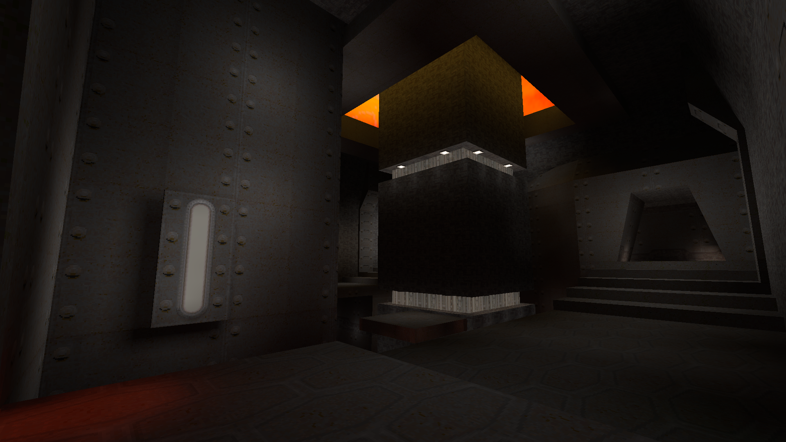
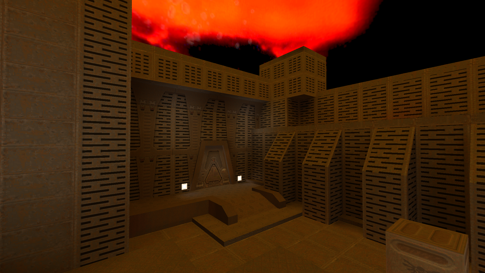
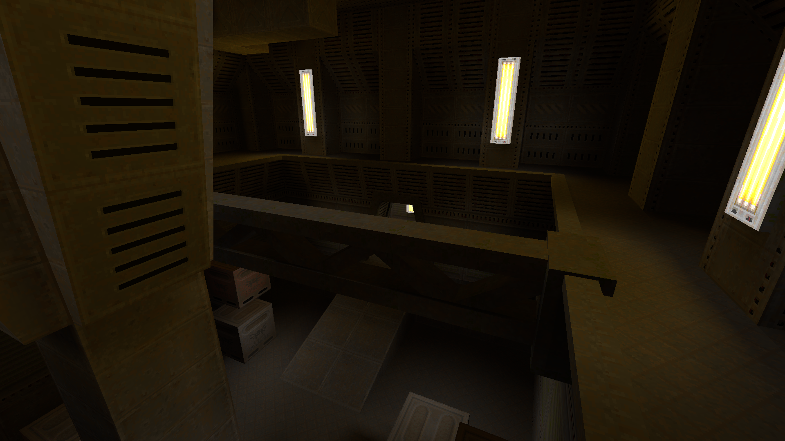
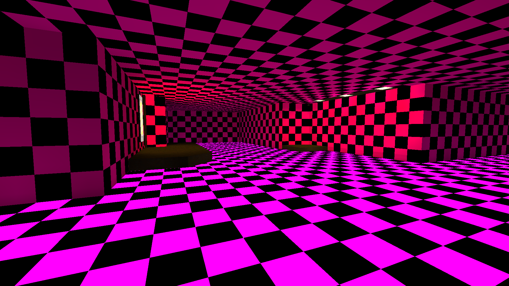

# Göld - Löve but for Goldsrc

This is a simple, LuaJIT-based game engine that allows people to write full 3D games in Lua. It
intends to emulate the simplicity and fun of modding games on Goldsrc/Source and the first 3 Quake
engines, but with something closer to Löve's attitude where native code is used for performance-
intensive things but Lua has as much control as possible. Having said that, I'm perfectly happy to
restrict things significantly if it makes things simpler, and as long as it'd be somewhat reasonable
to implement a game of similar technical complexity to Half-Life 1 on this then I'd be happy.

Currently all this does is load and render Quake 2 maps, although it does render them pretty nicely.
I hope to eventually seamlessly be able to load Goldsrc and Quake 1 maps, too, and possibly even
Quake 3 maps if it's not too much extra work (it's a format which lends itself far better to being
rendered on the GPU). Goldsrc and Quake 1 store mipmapped textures inline, though, so it's not just
a case of just converting it to the same structure as a Quake 2 map while loading. That's really the
only hurdle to implementing Goldsrc and Quake 1 maps, however.

 

 



I've also got a parser for the monstrosity that is the Goldsrc .mdl format, so my next task is to
get Half-Life 1 models loading, displaying and animating in this engine. I have a pretty good idea
of the game I want to build using this engine.

## How to use

Extract Quake 2's .pak files into a folder called `data` in the working directory that you'll be
executing the program in (so probably the project root, if you're executing with `cargo run`). You
can do this with a tool like [pakextract](https://github.com/yquake2/pakextract). I don't parse
`.wal` textures, so you'll have to bulk-convert any textures stored as `.wal` to `.tga`, `.png`,
`.gif` or suchlike. I'm just using the `image` library for my image parsing, since Goldsrc uses
`.png` and `.tga` textures anyway and the game that I have in mind as an "end goal" for this project
primarily reuses Goldsrc assets. To convert `.wal` to `.tga`, I would like to recommend Wally since
everyone else online does, but I've found that it consistently crashes when batch processing images
under Wine, and so the best way I've found to do the conversion is by a simple Python script using
the Pillow library:

```python
from PIL import WalImageFile

for vals in os.walk("."):
    root, dirs, files = vals
    for file in files:
        pre, ext = os.path.splitext(file)
        try:
            WalImageFile.open(root + "/" + file).save(root + "/" + pre + ".png")
        except:
            pass
```

If you don't do this, you'll see something which I'm sure will be familiar to many modders and
tinkerers of this era of games:


